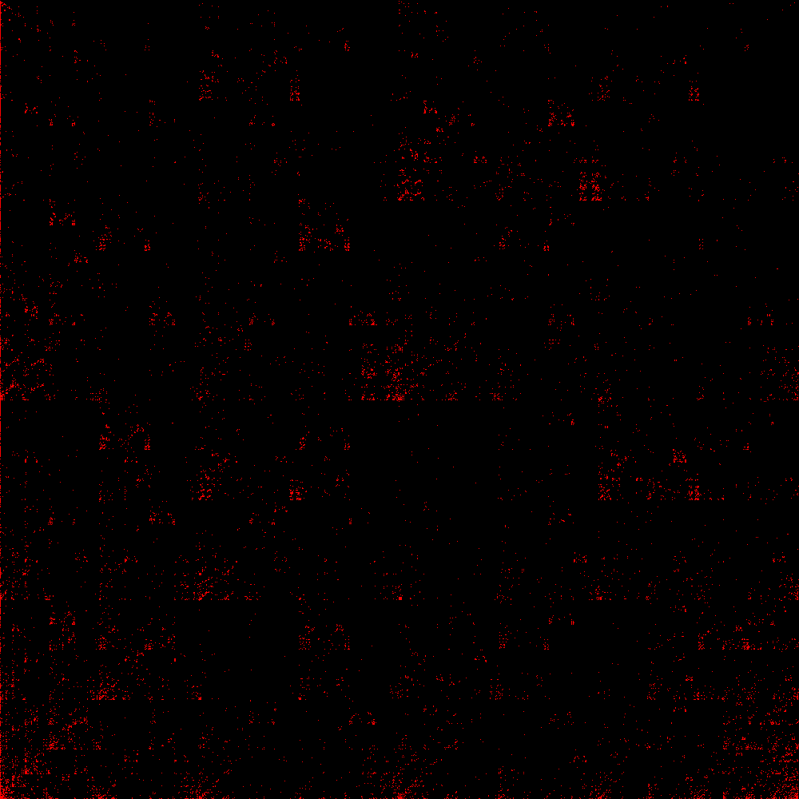

# ranvis

Trivial implementation of a tool to view binary blobs as space-filling fractals

## Simple invocation

The invocation below creates a space filling fractal of the inkscape program, using a binary colour gradation (bins). Using two bins is the most reliable option.

./ranvis /usr/bin/inkscape 1000 2 out.png

The output of this is:

